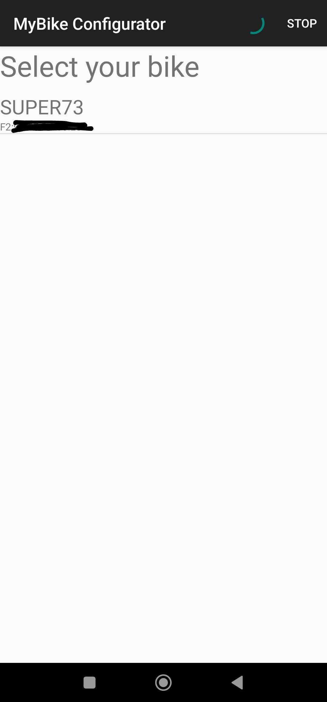
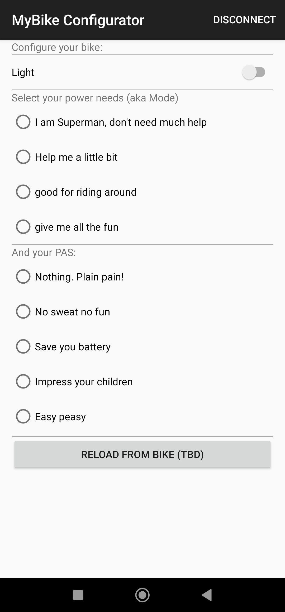

# MyBike_Configurator
Shortcuts to your Super

## apk direct download
lint to apk: https://github.com/QuaxelBrod/MyBike_Configurator/blob/master/bin/

## Usage

### grant rights

Because the app is rigth now only a proof of concept many things are not implemented. For example you have to grant rights to the two desired permissions. That is location and nearby or bluetooth. That may depend on your device. This permissions are needed to access the bluetooth device. At least your bike has to be cuppled to your phone. if the app do not request for that, you have to do that in you blutooth menue.

### use app
Power up your bike and start the app. The scan for the bike starts by opening the app. Find your bike in the list.
If you own more than one bike, you have to remember the BLE Address for your bike.

Then the configuration screen appears. Nothing fancy here. Just set your mode and close the app. Notice: no bike configuration is read. Only the mode, PAS and light settings are written.

That's it

Ah. and be carefull when in group ride. Now everyone can modify your bike settings  :D
